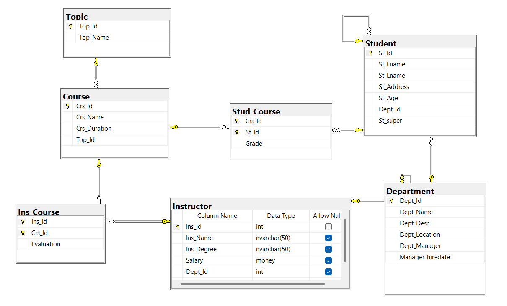
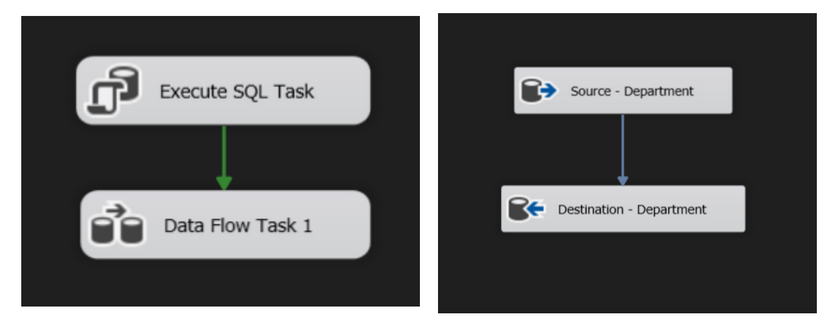
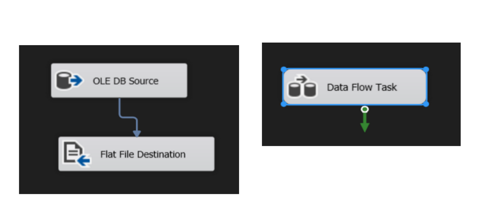
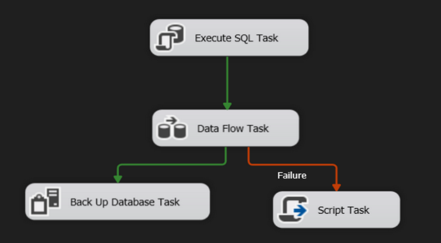
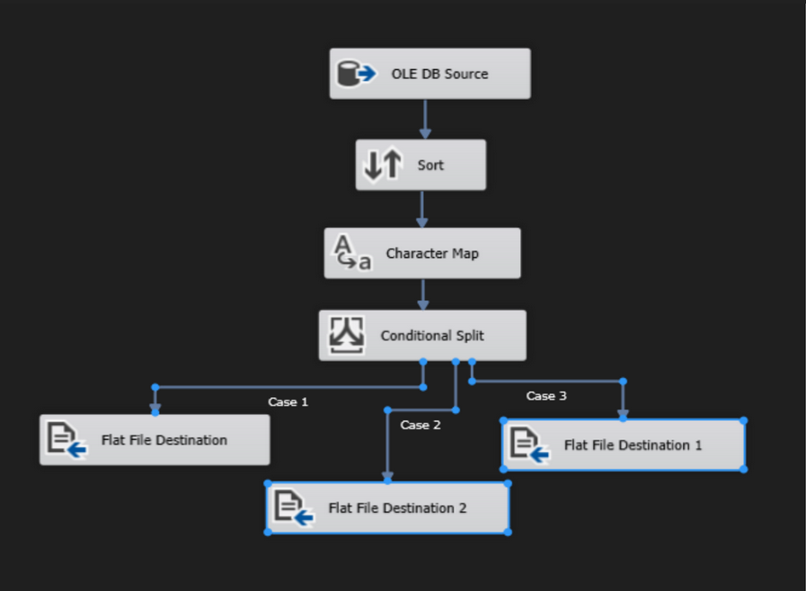
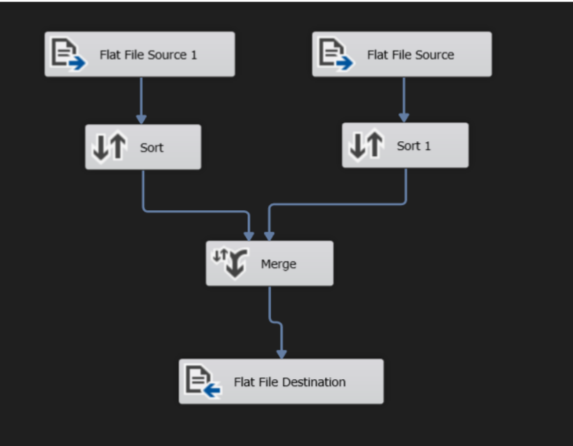
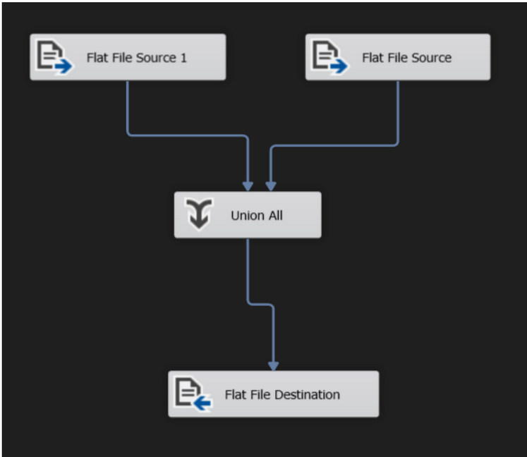

## 🗺️ Database Schema Overview

Below is the Entity Relationship Diagram (ERD) for the `University` database used in this project:

---
# 📦 SSIS ETL  Project – University Database 

This project demonstrates end-to-end **ETL solutions** using **SQL Server Integration Services (SSIS)**, based on a lab assignment using data from a `University` database. Each task showcases various SSIS components including **data flow**, **file output**, **error handling**, and **data transformation**.

---

## 📁 Prerequisites

- Microsoft SQL Server with SSIS support
- SSMS (SQL Server Management Studio)
- Visual Studio with SSDT (SQL Server Data Tools)
- Databases:  
  - `University` (source DB)  
  - `Test` (target DB – created manually)

---

## 🧪 Tasks Overview

### ✅ Task 1: Department Table Transfer

**Goal:** Transfer `Department` data from `University` DB to `Test` DB using the **SSIS Import/Export Wizard**.

#### Steps:
1. Truncate the `Department` table in `Test` DB before transfer.
2. Use Import/Export Wizard to copy data from source to destination.

---

### ✅ Task 2: Export Student Data to File

**Goal:** Export selected fields from `Student` table to a delimited `.txt` file.

#### Steps:
- Columns: `St_id`, `St_Fname`, `St_lname`, `St_address`
- Use **Flat File Destination** with:
  - Delimited file: `Student.txt`
  - Column headers as first row

---

### ✅ Task 3: Transform & Load Student Data

**Goal:** Load `Student` data into `Test` DB with transformation and backup.

#### Steps:
1. Use **Execute SQL Task**: If `Student` table exists in `Test`, delete all records.
2. Use **Derived Column**: Merge `St_Fname` + `St_Lname` into `FullName`.
3. Perform **full backup** of `Test` DB.
4. On any error, show message: **"error occurred"**

---

### ✅ Task 4: Course Data File Split

**Goal:** Process and export `Course` data into 3 separate files based on course duration.

#### Steps:
1. Select Course + Topic from `University` DB.
2. Use **Sort Component**: Sort by `Crs_name` descending.
3. Use **Character Map**: Convert `Crs_name` to lowercase.
4. Use **Conditional Split** to route:
   - `File1.txt`: Courses < 30 hours
   - `File2.txt`: Courses = 30 hours
   - `File3.txt`: Courses > 30 hours  
   (all files should have column headers)

---

### ✅ Task 5: Merge Course Files

**Goal:** Combine `File1.txt` and `File2.txt` into one consolidated file.

#### Steps:
1. Use **Sort Component**: Sort both by `Crs_name`.
2. Use **Merge** or **Union All** to combine.
3. Output result to a new file ( `MergedCourses.txt`, `UnionCourses.txt`)

---

## 📌 Summary

| Task | Description | Techniques Used |
|------|-------------|------------------|
| 1 | Copy `Department` to `Test` DB | Wizard, Truncate |
| 2 | Export `Student` to `.txt` | Flat File Destination |
| 3 | Transform + Load `Student` | Execute SQL, Derived Column, Backup, Error Handling |
| 4 | Export `Course` to 3 files | Sort, Character Map, Conditional Split |
| 5 | Merge course files | Merge, Union All |

---

## 📷 Screenshots

All tasks are illustrated with actual SSIS package designs and execution screenshots.  
Check the `/screenshots` folder for detailed visuals.

---

## 🔗 License

This project is for educational use under the MIT License.
